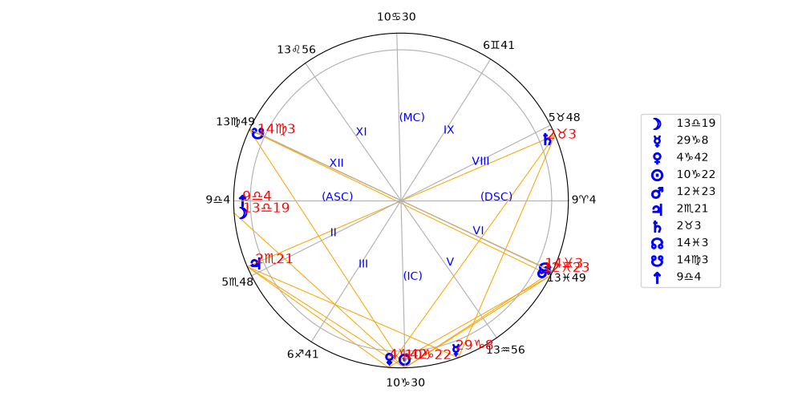

# MyAstrologyTool


> ⚠️ **Development Status: Beta**  
> This project is currently in active beta. The core structures are stable, but specific calculation logic and available features are in flux
> Basically you can enter latitude and longitude, birth time and date, and timezone, and get a chart. This leverages several libraries to get this astronomical information into a usable arrangement.

## Installation
```bash
git clone https://github.com
cd your-repo-name
python -m venv venv
source venv/bin/activate  # On Windows: .\venv\Scripts\activate
pip install .
```

### Sample Plot Output

